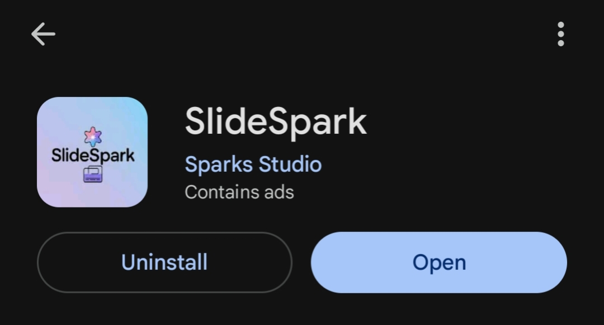
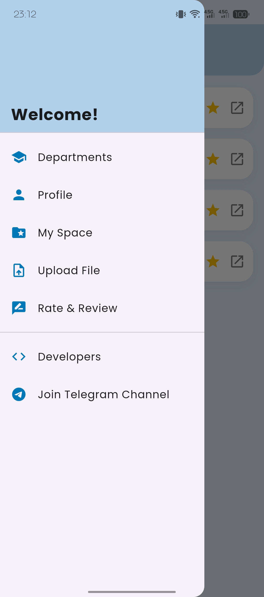
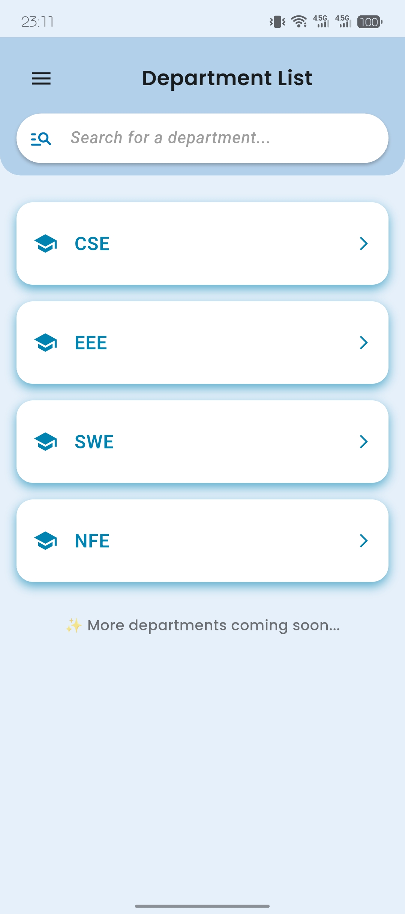
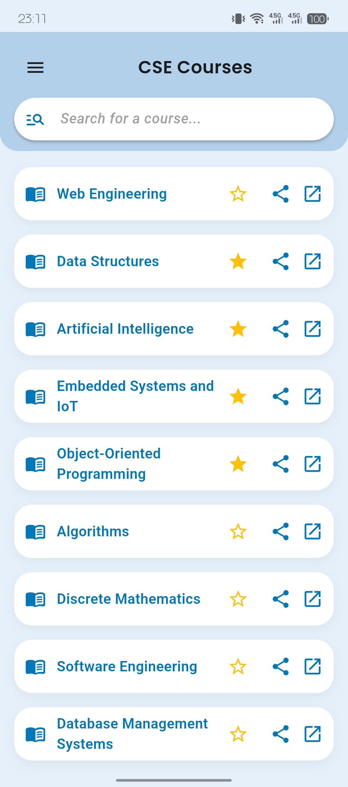
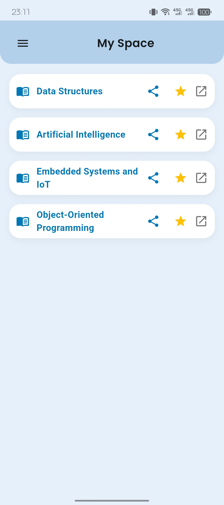

# SlideSpark 📚⚡  
Your go-to app for accessing course slides and class content, organized department-wise. Built with students in mind.

### 🔗 [Available on Google Play Store](https://play.google.com/store/apps/details?id=com.SparkStudio.slideSpark)

  

---

## 📱 About the App
SlideSpark helps students easily find and manage slides for their academic courses across various departments. Whether you're in CSE, EEE, SWE, or NFE, this app ensures that your study resources are just a tap away.

---

## ✨ Key Features
- 🔍 **Effortless Slide Search** — Quickly find slides by department and course.
- ⭐ **Favorites** — Save daily-used slides or content for quick access.
- 🔗 **PC Sharing** — Send slide links to your computer easily.
- ⬆️ **Community Upload** — Upload course materials that are not yet available.

---

## 🧰 Tech Stack
- **Flutter** — Cross-platform mobile UI
- **Firebase** — Firestore, Storage, Authentication
- **Google Sign-In** — Seamless login experience

---

## 📸 Screenshots

  
  
  
  

---

## 🛡️ Note
> Source code is private due to proprietary logic, data handling & Security.  
> For collaborations or inquiries, feel free to [reach out](mailto:sanik4144@gmail.com).

---

## 🧑‍💻 Developer
Saifullah Anik  
🔗 [LinkedIn](https://www.linkedin.com/in/saanik/) | [GitHub](https://github.com/sanik4144)

Salman Af Rahman

🔗 [LinkedIn](https://www.linkedin.com/in/salman--rahman/)

